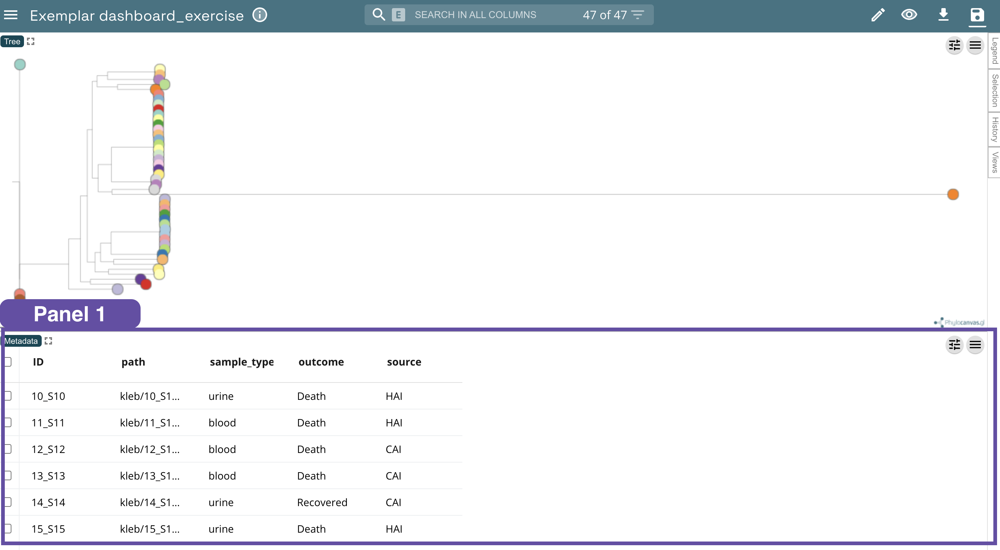
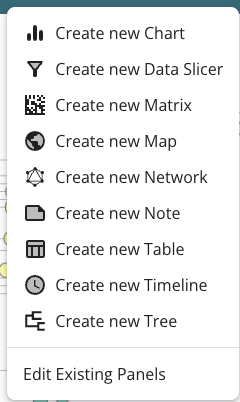
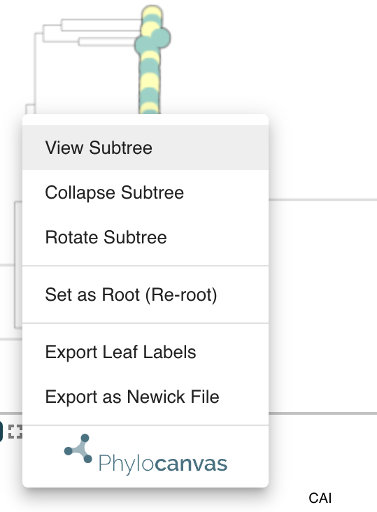

# **Visualisation and interpretation of phylogenetics using Microreact** 

Microreact ([https://microreact.org/](https://microreact.org/)) is a public, open-source, web-based application that promotes data review and analysis through the rapid generation and linkage of interactive data visualisations. 

Microreact users build projects either by uploading data files or by providing links to data files via URLs. Users can then build panels to showcase the data in a customisable way. A panel within Microreact is a pre-configured visual (Tree, Map, Table, Chart, Network, Matrix) each with its own set of customisable features (colour, layout, labels, etc). 

Panels can be filtered and snapshots of data can be saved and shared. These snapshots enable users to set up a particular filter or explore a selection of samples or group of visuals to refer back to with the goal of facilitating understanding of complex public health data. 

Microreact can be deployed securely on a local server, adhering to local data governance. Users can make their Microreact projects findable on local networks, or share them privately with other users. Microreact projects for public consumption can be shared on the public Microreact site. 

The data for this exercise can be found here: **https://drive.google.com/drive/...**

### **A. Creating an account (Logging into your Microreact account)**

| **Description** | **Image** |
| :---- | ----- |
| **Open Microreact**  Use [https://microreact.org/](https://microreact.org/) to access the public site.  Click on “My Account” in the upper right corner of the page.  ![][image54]Tip \- Make sure you don’t put protected health information into the public site. Always use a local installation for sensitive data.  |  |
| **Sign in using your credentials**  Select your preferred sign in method.  Input your login credentials. If using the public site, you will create your own login credentials (or use the credentials associated with your sign-in method i.e. Google or Twitter)  If using a locally-installed version, use the login credentials assigned by your IT department  |  *Public login page* |
| **View My Account page** Now that you are logged in, you will see your Account page where you can manage your projects and account settings.  |  |

### **B. Navigating Microreact**

| **Description** | **Image** |
| :---- | ----- |
| **Click the menu icon**   The menu bar can be accessed by clicking on the ![][image58] icon on the upper left corner of the page.  Clicking the icon brings up the main menu.   |  |
| **View the four main pages**   This menu allows you to navigate the site. The site has four main pages: Showcase Upload Documentation My Account You may also use this menu to sign out of your account by clicking “Sign Out”. You may also submit feedback to the developers about Microreact by selecting “Send Feedback”.  ![][image54]Tip \- These four menu options are also easily accessible on the upper right corner of the page.  ![][image60]For more information about navigating Microreact visit: [https://docs.microreact.org/instructions/navigating-the-site](https://docs.microreact.org/instructions/navigating-the-site)   |  OR    |

### **C. Microreact terminology** 

| **Icon** | **Description** |
| ----- | ----- |
| ![][image63] | Display additional menu options. It can be found either within individual panels, or at the top left of your microreact account. |
| ![][image64] | Opens a menu to let you edit or delete existing panels, as well as add a new panel. |
| ![][image65] | In this menu you can control selections for labels, colours, and shapes.  |
| ![][image66] | Download individual project files, such as the metadata file, .newick files, etc.  |
| ![][image67] | Update who has access to the project as well as find sharing links and create an easier alias link. |
| ![][image68] | Allows you to save a new project, update a current project, or download a file containing the complete project. |
| ![][image69] | This is the configure icon. It expands or collapses additional buttons or menus. |
| ![][image70]![][image71] | The maximise icon expands one panel to cover the whole dashboard; the minimise icon returns the panel to standard size. |
| ![][image72] | This is the lasso tool (or polygon lasso). It allows you to draw a filter around points of interest on a network or tree to create a custom filter. |
| ![][image73] | Shuffles the nodes in a network. |
| ![][image74] | Automatically adjust the tree or network size to the current panel size. |
| ![][image75]![][image76]![][image77] | Controls whether the tree is stretched/compressed in all four directions, only horizontally, or only vertically. Click the icon to toggle through the three modes. |
| ![][image78] | This appears in the data table headers and allows you to filter by values or build filter conditions in any of the columns. |
| ![][image79] | In the map panel this viewport button filters the dashboard to only things currently visible in the map panel. |

| **Name** | **Description** | **Image** |
| ----- | ----- | :---: |
| Panel | Each individual dashboard element in Microreact is called a panel. The dashboard in the image has two panels \- metadata and chart. |  |
| Side panels | On the far right of the screen is a side panel with options:  **Legend:** shows the legend for the colour and shapes in use in the project. **Selection:** shows a donut chart of the distribution of whatever column you choose for the currently selected samples. **History:** shows a history list and allows you to revert to a prior state. **Views:** allows you to create and save multiple customised dashboard presentations in a single project. |  |
| Title lozenge | Each panel has an editable title. If you have panels overlaid, there will be multiple sections. |  |
| Search-and-filter bar | Typing in the top search-and-filter bar will filter the data across all columns in the metadata. Clicking the “E” will enforce an exact match requirement. |  |
| Top menu bar | Always visible along the top. |  |
| Left menu  bar | Accessed through the hamburger icon at the left of the top menu bar. |  |

### **D. Building an exemplar data dashboard**

Now that you’re familiar with the basics of navigating Microreact, this section will walk you through an exemplar outbreak. All metadata in this outbreak is simulated and not based on any real data. Nonetheless, we hope this will help you understand how you can use Microreact to visualise different datasets together to make relevant decisions. 

---
#### **1. Importing data**

| Upload files  |  |
| :---- | ----- |
| **Navigate to the Upload page**   On the home screen, click the “Upload” button in the upper right corner.  You may also use the “Upload” button located in the main menu (see Navigating the Site section of this tutorial).   |   |
| **Browse your files**  Clicking the “Upload” button brings you to the screen shown here.  Use the  icon to select the files you want to upload. Alternatively, you can drag and drop the files directly into the centre circle.  For this exercise we will create a project with the following files: `metadata-kleb.csv` and `iqtree-ml-kleb.tree`. The files can be found here: **https://drive.google.com/drive/...**  ![][image54]Tip \- Microreact supports the following file types: **.csv**, **.xlsx**, **.xls**, **.ods**, **.tsv**, **.nwk**, **.newick**, **.tre**, **.nex**, **.nexus**, **.nhx**, **.dot**, **.geojson**, and **.microreact** |     |
| **Verify your file type** Microreact will automatically identify each file and each file type. Double check that each file is present and the file types are correct. `metadata-kleb.csv` : `Data (CSV or TSV)` and `iqtree-ml-kleb.tree` : `Tree (Newick)`. |  |
| **Select the ID column for each file**  You will then be asked to specify the ID column in the metadata file. This needs to be a unique value for each row in the dataset. In this example, it’s the "ID" column. If you upload multiple data files, they **must** have a common ID that allows Microreact to join the datasets. Microreact will make a guess at each data files’ ID column. Verify it is correct and then click “Continue” to move to the next file.   |  |
| **Select the labels column for the tree file** The tips of the tree need to have an ID that matches to an ID in your metadata in order to be able to colour, label, and add metadata blocks. |  |
| **View your initial dashboard**  Microreact will automatically bring you to your dashboard. For some purposes, this output might be satisfactory for your use case. However, we will be enhancing this to showcase many of Microreact’s features.  |  |

---

#### **2. Saving your project**

| Saving your Microreact project |  |
| :---- | ----- |
| **Rename your dashboard**  Since we will continue to edit this dashboard, let’s give it a name so we can easily locate it on our Accounts page.  In the upper left corner, double click the field “Unnamed Project”. You will now be able to edit the title.  Rename the project “Exemplar dashboard\_exercise” and hit enter on your keyboard. |    |
| **Save your project**  Navigate to the upper right corner of the page and click the Save icon ![][image96].  |  |
| **Save as new project** Click “Save as New Project” to add this dashboard to your account.  |  |
| **Setting access permissions for your project** You will then be shown a link to access your project at a later time or share your project with others.  Select whether you would like to save the project to your individual account or whether you would like it to be accessible to others.  For this exercise, let’s select “Private” so it will only be available in your personal account.  |   |

---

#### **3. Editing the metadata panel**

| Panel 1: Metadata panel  |  |
| :---- | ----- |
| **View the metadata**  The Metadata Panel appears at the bottom of the dashboard. Scroll through the rows and columns to view the imported data.  You can use the Metadata Panel to search through your metadata, sort the columns, rearrange the columns or hide unneeded columns.  |    |
| **Adjust displayed data** Select the ![][image102] icon. Two new lozenges will appear called “Columns” and “Density”  |  |
| **Filter columns**  By default all columns in your dataset are shown in the metadata table.  Select the “Columns” lozenge and a list of all columns in the metadata will appear. Tick/untick the green checkboxes to show/hide metadata columns on your dashboard.  Toggle the “Select all” button off. Now manually check the following columns: "ID", "sample\_type", "outcome", and "source" ![][image54]Tip \- you can also filter the metadata rows. Tick any of the checkboxes to the left of your "ID" column. This action highlights the selected sample(s) in **all** dashboard visuals.  |  |
| **Show the legend** Click the “Legend” tab on the side panel to show the legend. This will show all active colours and shapes on the dashboard.  After importing our data, we see that the Map, Network and Tree files are all displaying data by sex (notice the consistent green and yellow throughout the dashboard)   |  |
| **Change the colour scheme**   Click on the eye icon in the upper right corner of the dashboard.  The **Colour Column** is the field used to colour map markers, tree nodes, chart features and timeline blocks. Any column in the metadata can be used to colour the panels.  To change the colour scheme of our Tree Panel to match the colour scheme of our Bar Chart Panel (see Panel 3 later), select “source” as the **Colour Column**.  |  |

---

#### **4. Creating dashboard views**

Each project has a side panel which will show the Legend, Selections, History and Views for the entire project. In this demonstration, we will focus on the **Legend** and **Views** panes as these are the panes you will use the most.

The **Legend** reflects the colours and labels used in the project.

The **Views** pane shows a list of saved views associated with the current project. Think of a view as a snapshot of your dashboard with a particular filter, sample selection, or group of visuals that you want to refer back to. You can create multiple views within a project to tell a story or explore a subset of geographies or cases. Each saved view has its own URL, so an individual URL can be shared to bring others directly to a specific view. Whatever you are looking at on your dashboard will become your view. Set your dashboard as you like, add a view, and give it a name. If you wish to change what you have done, manipulate the dashboard, and select “update view”, then save the entire project. When updating, make sure you select the View you wish to change or else a different View may be overwritten.  ![][image60]Learn more about the side panel options such as Views here: [https://docs.microreact.org/instructions/interacting-with-microreact-projects](https://docs.microreact.org/instructions/interacting-with-microreact-projects)

| | |
| :---- | ----- |
| **Create a View** Click the “Views” tab on the side panel (located beneath the Legend tab).  Click the plus button to save this view or snapshot of the dashboard. This will create a small screenshot of your dashboard, initially named “Unnamed View” Hover over the image until a circle icon appears ![][image107]. Click on the circle icon, select Rename View and name the view “Overview \- All Samples”    |     |
| **Save the View** Hover over the image until a circle icon appears ![][image107]. Click on the circle icon, select Update View. This saves the view in your side panel.  Any time you make adjustments to your dashboard that you would like to save, return to this menu to update the View.  ![][image110]Tip \- Don't navigate away from a View until you've selected “Update View” to save any changes, and don't forget to save the whole project after making new Views or changes to Views.  ![][image110]Tip \- Saving a View will also save all associated formatting. Feel free to resize or reorder the panels and then update the view to lock in those changes.  |  |

---

#### **5. Editing the charts panel**

| Panel 2: Chart panel  |  |
| :---- | ----- | 
| **Create a chart panel**  Locate the ![][image64] icon in the upper right corner of the screen.  Click “Create New Chart”.   |  |
| **Drag and drop the Chart Panel on your dashboard**   Use your mouse to drag the Chart Panel so that it overlays the Timeline Panel.  Once the panel is in place, click your mouse to insert the panel. A white canvas will appear for you to start building the chart.    |  |
| **Select your chart type**  Navigate to the “Chart Type” lozenge.  Select “Bar Chart”.   |  |
| **Change the x-axis**  Navigate to the “X Axis Column” lozenge.  Use the drop down arrow to specify “outcome” as the x-axis value.   |  | 
| **Change the criteria for column colour**   Navigate to the Colour lozenge.  Select “sample\_type” as the Colour Column.  |  |
| **Change the chart facet** Navigate to the Facet lozenge.  Select “source” as the Facet Column and change the number of columns to 2\.   ![][image54]Tip \- Click the ![][image69] icon again to make the menu options disappear. This helps to visually tidy your dashboard\!  |  |
| **Final result** The resulting Chart Panel should look like this figure.  Note, your Metadata Panel is still accessible. Select the title lozenges to toggle between Panels.  |   |
| **Update View** If your chart panel matches the above, go ahead and update the View to save your changes.  Hover over the sidebar View image until a circle icon appears ![][image107]. Click on the circle icon and select Update View. This saves the view in your side panel.  |  |

---

#### **6. Editing the tree panel**

| Panel 3: Tree panel  |  |
| :---- | ----- |
| **Edit the Tree Panel Metadata Blocks** Metadata blocks are coloured blocks that sit next to each tip on a phylogenetic tree and are coloured based on a selected column in the metadata. These are a powerful tool because you can view multiple columns of data at once. Select the Metadata Blocks lozenge.  All metadata columns appear in this menu. Tick the boxes of the metadata fields you would like to appear on your Tree Panel. For this exercise, select the following blocks:  `sample_type`,`outcome`, and `source` ![][image54]Tip \- Click the ![][image69] icon again to make the menu options disappear.  |  |
| **Final result**   The resulting Tree Panel should look like this figure.  |  |
| **Update View** If your tree panel matches the above, go ahead and update the View to save your changes.  Hover over the sidebar View image until a circle icon appears ![][image107]. Click on the circle icon, select Update View. This saves the view in your side panel.  |   |
| **Create a second View** Now that we have saved our main view, we may have other ideas for additional views to create from our dashboard. Let’s create a second View to show samples clustering in this phylogenetic tree.  First, toggle back to our Chart Panel.  Click the “Views” tab on the side panel, and then click the plus button. This will create a small screenshot of your dashboard, initially named “Unnamed View” Hover over the image until a circle icon appears ![][image107]. Click on the circle icon, select Rename View and name the View “Cluster”  Now, let’s add some additional modifications to this second View.  |  |
| **Changing our colour scheme** For this view, we want to investigate a specific cluster. In this example, we will next view our data by source to see if any patterns in our data emerge.  Navigate to and click on the eye icon in the upper right corner of the dashboard.  Change the colour column of our view to “source”.  |  |
| **Viewing sub-trees** After viewing our data by "source", we may choose to investigate a specific cluster more closely.  Right click on the node of the top branch and select “View Subtree”.  This action not only zooms in on this portion of the tree but it also filters the remaining panels to show only the samples in this cluster. |  |
| **Update the View** Now that we are visualising data from a specific cluster to further evaluate our outbreak, we are ready to update this cluster investigation View to share with others or refer back to later.  Hover over the sidebar View image and click the circle icon, then click Update View.  ![][image54]Tip \- You will see the changes we made to the View represented in the sidebar image.   |  |

---

### **E. Access permissions and data sharing**

|||
| :---- | ----- |
| Sharing your project There are several ways to share your work with others.  *Option 1*: First, you may download the .microreact file and send it as an attachment to an email or upload it to a shared drive.  *Option 2*:  Another way is to navigate to the Project Access icon ![][image67] in the upper right corner of the screen. Clicking this button will bring you to the Share with People menu.  | Option 1:  Option 2:   |
| **Navigate to the Project Access menu**  Select the Project Access menu icon at the top of the screen or within the project folder on your Account page.  By default, a saved project on microreact.org can only be accessed by the user who created it. Access must be explicitly granted for others to view it. |   |
| **Give a project Private Access** You have the option to restrict access to the project to a limited number of other users. Select Private from the drop down menu in the Share with People screen.  You can grant others access to your project by providing their email addresses (up to 30 invitees).  |   |
| **Share with anyone with the link** Select “Anyone with the link” from the drop down menu on the Share with People screen.  Click the copy icon to the right of the Project Link provided to copy the link and share your project with whom you choose.   ![][image110]Tip \- If you have a locally installed version of Microreact, “Public Access” will be limited to the user accounts within your network.  |  |
| **Adding an alias before sending your projects**  Before sharing your project link with others, it may be helpful to edit the URL to a shortened and/or more meaningful version.  Click the alias icon to the left of the Project Link provided.  An Alias menu appears for you to edit the URL. Click the save icon when you are finished to save your changes.  |   |
| **Downloading projects, views and panels**  Each of the original files used to create a project can be downloaded from the Download Project Files menu. Data can be downloaded by anyone with access to the project. Individual panel visuals can be downloaded by clicking the ![][image163]icon in each panel. You have the option of downloading the original file format or a static image (PNG or SVG).  Original project files or image files can then be shared with others.  |    |

[image54]: <data:image/png;base64,iVBORw0KGgoAAAANSUhEUgAAABsAAAAcCAYAAACQ0cTtAAACJklEQVR4Xr2WSy8DURSAbe0t/AM/wUKk8QgJwkKKqtSj9OVZj3qWFi1tlCpFg4RERPwFe1uqnc70sZOIxI845gw3ptfMmBlpv00zp3fmm3PvOaetqNBB+0EO6FjJcKyz5ZMFJtPlk12bX97omC5aD3MwtMX9682bj/IQsafUPWNxgYEDW/HiukQeDCd5aDrOQ2ssB1gkXZEsdIezResa+DVhl0oR4bbvWbih9rwAgui08ECvQXp3sw/mIAeD37sRnNB5nkREx6Ww+lmw663S2otCVK2IML7GwsxKJkrH/6QuUdAkIswtZrTfZzjVlhXBwxcXHVNEjWjEL38+6zMahI1xeZllmwMlEbI5pVCR5gAHy3MMnA2/CItaYvKD9i8RQsq/g+9Fl5eFXaW+a4vKy2wbrPCAqZXMO/0dIexUeDhN534OjCGuho6LmV2SrrqQM1mzr3ZUEXpCxWNIDIo8Huki0CxCTDvSwxhFCzIiJDamQ4aMbP4uBrmMEN0ixOZjl5ze30KvmwH/dHF5H/Ki+GjSJ46pBgcrfk6uZsAtUQwB0XQXRNavtqk/k+9RSVB0b2SqybX4jPiMPlAUEvUOESGmvWwVviC5VgR/l+56n1lxbHmeAbJ1RBRxpIBklBj6kSHbE+mnS0tSnZDG7X6tpM+IgKJ742MlHf8Xcv+odGeghHjrjvmtwzmKoquBEsj2HNI9dGMqgSxq+8no4jujm/4kFpNq2ScrK2TeQeV80QAAAABJRU5ErkJggg==>

[image58]: <data:image/png;base64,iVBORw0KGgoAAAANSUhEUgAAABoAAAAaCAYAAACpSkzOAAAAS0lEQVR4Xu3NwQkAIAxD0S7lTo7g9noP9NBQDUgK71IIP8Zc+4XAxy0O0Ryi6UPVwz1KQ930oerhHulD3fSh6uEepaFuDtEcov0XOrPE2JwhlupJAAAAAElFTkSuQmCC>

[image60]: <data:image/png;base64,iVBORw0KGgoAAAANSUhEUgAAABsAAAAbCAYAAACN1PRVAAAAl0lEQVR4Xu2SQQ6AIAwE+wzj/3/hxZ9prJEg1O5SiBedhAs7W3pA5OdkM85wyges0w07jPUeiZQjHcUrRTMTtCHKvLyiSTag+8xmTI4chRGZHDkKIzI5chRGZHLkKIzI5MhJILE3v4E2Q5mXV6ziF1C2lJeI5g0l1klcZTSA9SD5oHxgedf9UM4s9fDjTLn08z2G/rLX2AFXyGFOeEwXmAAAAABJRU5ErkJggg==>

[image63]: <data:image/png;base64,iVBORw0KGgoAAAANSUhEUgAAACgAAAAoCAYAAACM/rhtAAAAZUlEQVR4Xu3OsQnAMAwFUS+VnTKCt096NTacQEKc4DUqPreed3+drfjoxkDKQMpAykDKQMpA6jow6+LuyZzAKgZS14FZF3dP5gRWMZC6Dsy6uHsyJ7CKgZSBlIGUgZSBlIFU+8AfMDrLpKI/EPkAAAAASUVORK5CYII=>

[image64]: <data:image/png;base64,iVBORw0KGgoAAAANSUhEUgAAACsAAAArCAYAAADhXXHAAAAA7klEQVR4Xu3ROwrCQBSF4WzFjbgGwV4XYC021prWSluxsRSsLKxcj4KK9YQjDAwzQsLNnBsD98BPQh7wkRSD8dT1pSK+8M8ZlpVhWRmWlWFZGZaVYX81KTfu/ny59fGU3GuaChbQcNvzJXmmSZ1gsVLwhalYIJE/D/d4f5Ln66JhQ1wMBnQ4WyTv1EXBxl8RC8ESKMqODaGH683Nd/sELC0rNoaOlqvvEZP++rBsWDYUZcFqQFFrrBYUtcJqQpEYqw1FImwXUCTCAqQNRSKsnyYUtcL6aUBRFqwGFImwXWVYVoZlZVhWhmVlWFa9wlYZTetICYCWdwAAAABJRU5ErkJggg==>

[image65]: <data:image/png;base64,iVBORw0KGgoAAAANSUhEUgAAACsAAAArCAYAAADhXXHAAAACCElEQVR4Xu2WQUuCQRCG/Ssdu/YnugbWxUMFHTwE2iWCiPRQkQaCUBqYERoFCV0yohQKUToIeSnI6BZhHQoqOm++i7N936roqisKO/DAMjsz+zqOg44R5wwbFhyyY5AxYnVhxOrCiNWFEasLI1YXRqwueiJ2bG6BzYdj7Og6zz6+vhkZzvDhDjFynipdiR11uVn07FKIa2WIRY5cp106FutcDdi6mMjmmDcSZ661EJtY2eDgDB/uyJAzvuirq9cOHYmd3gyLx08LRSFwNrDNUvkiK7++cXCGj4Qjlgw15LqtUBaLrpD5kynRRW9kX/hlwx3F+RMp4VftsJJYzFv5pcIfCp6khYAp35YYiWg6w39MAGcY7hBD8ciFoZbKDCuJXd475I9kSw/iYWtXL4qlupzbx2d+5w7t2nJQA4aack4zlMRiDmFLsaTtYepUo4fpA1q/CYAaMNSUc5qhJJYeztzdN+zs+SB1ls9srbvWTk1W5/Hz55f7sUvFzNZ2MO4QI38TqKVtZoFtGySs2yAu/LLZtkGyT9uAsO5Z7FLX+v+exS59qrxzcBZ7thqDWLK+7FkCXaGvHnZwlWOenbgQTgLhwx0ZclQ7SnQsFvD/BrVd2o4hVmVGZboSS0CAp/rP6vimIH6AMJzhw103IomeiO0XRqwujFhdGLG6MGJ1YcTqwojVxVCJ/QN6p24ePlEXmQAAAABJRU5ErkJggg==>

[image66]: <data:image/png;base64,iVBORw0KGgoAAAANSUhEUgAAACsAAAArCAYAAADhXXHAAAAAyElEQVR4Xu3WsQ3CQBBEUbdCTc6hE2IIiWiEjBxaIKAXw2RouAN8u2OwmJV+Yu1Zz4Gl6xb9aphLHT/45YxVZawqY1UZq8pYVanY8+U68Jzuz3ivtVRsbXivNWN5eK81Y3l4r7Uwtl9v2VYd7PL5MYWxy82OTdX5OhbtD0d2PQ0+is+NLQWLXoEzoCgNi0rgLChKxaJHcCYUpWMRkNGfqZQEq+p/sKUr4buJXBknx+IMv+fTQtipM1aVsaqMVWWsKmNVGatqVtgbEnMPVzeo58QAAAAASUVORK5CYII=>

[image67]: <data:image/png;base64,iVBORw0KGgoAAAANSUhEUgAAACsAAAArCAYAAADhXXHAAAAB9UlEQVR4Xu2VS0tCQRSA/SutQlrZskW0C1q0iaJcqCC9iKQWYrgJQdACoyAxwkWLqDZRYRZikIvKRa+N9IACIaJVQUXryXNrLuOZi49xBozmwMfgmTN3PueeUVtLn5v8FWw40cxoWVVoWVVoWVVoWVVoWVVoWVX8b9nhWILE9zJkYfuADIVj3HwjSJPtGPeTy8ciwbGTvyCtA16uXgRpsrnCLfY0YzV9xNWLIEW2NxjGflw4PD5uXb1IkZ2MJ7EbFz2BELeuXqTIeuaWsRsXXb4gt65epMg63D7sVhY3xWdujQhSZIHplTXsaEZ/aJ6rF0GaLADtwP58Za8KxuVjaxL7WWPu8PyaW18NqbKUNucYsQ+OmJ/bvVPmeP/0Ysi+vn+YebtzlHuGFVJkYVNXZJFEtnZJunRigCu6ZM6BGEjCiOPs7sEYqXglGpLt9s+SjeMTtP1PdE4EjJpo6QuwAW0A66zy+PkYYdnN3GnZZjhoHbzi/O/pYSEqDPO1tIKQbDC5znpZhlU9jGweThgCpPEeVgjJwk2uFrQWToz2JbQM+xz6ywDzynq2Flnas/gtgPBMKZdIZcryuEWsUCZLXy2c7Nvnl9HjMLLB5pWdLIiAcCVAgl4adqSXDQRruVQsQrKN0HT/YKrQsqrQsqrQsqrQsqr4Bk+hnaYkqw2FAAAAAElFTkSuQmCC>

[image68]: <data:image/png;base64,iVBORw0KGgoAAAANSUhEUgAAACsAAAArCAYAAADhXXHAAAABIUlEQVR4Xu2WsQ7BUBSGvYrR6iU8gM3AYDBIxCIRi9XamdEriIcwmD2AxEKCmCu/pAl/9aQ9tyeI8yff0vv39BvubVupNjvxr1DhC9+My1rhsla4rBUua4XLWuGyVqhlG6NpfDxf4iJBvz2LUrPyopY9XW/skjtaYbVskvVmG9e7w9R6AtbQ4WiEg2Ul0QR03qWocLBsrdVLrTFZstjD3JUIll3l2AboZIX7EsGyoeG5Ei5bJDxX4r9l8bEYRPPHwQKTxZIrL+G5EqXLQpS7uJYV7kqULvvuvZv1nkW4K/Hfstij3JX2LXclSpdF+k8HbCyIIjxXQi0b8ouYZLc/pOZKqGXx842HaYN7MYPnSqhlP4HLWuGyVrisFS5rhctacQe5fT0XStGAHAAAAABJRU5ErkJggg==>

[image69]: <data:image/png;base64,iVBORw0KGgoAAAANSUhEUgAAACIAAAAjCAIAAAB+eU8wAAACy0lEQVR4Xq2WW04qQRCGZyO8uwGXwWZcgCzDZfAoIRpM8MGgAiYabsJBLhGQm3KJeA6H8800DD01F2bC+R4wdnXV31Vd3dPGnyj8diLN/hh/D7FcLtvt9i9/Pj4+1uu1dHPiK4Nnt9uVIQOZz+d+et4yzGaNMkwI/DIzNi5YVPMI3t7eiCtiShlmSL/ofH5+CiWHDLvNWqRTIMlk8u7uTo66ctrLMNrpdOT0QNCIxWKnp6fSYEEf20pbGf7/+vqSEw9xfn4es5CGHcR0yIzHY92snAOIx+NNTUbn4uJCD0XjbWVIhQOo26Sri/AyPz8/WxmuDd0QnoNFg/f39+25+f7+lsZwhJGh5aibeQv0+31pdJJIJGgqOWrh19A61M1AKvisqK4NXnIwHEeD7pbDTo6Xmc1mhuf+q7gCZaLHpMGJ6DSYTCYGhROjzf8tMxqNTBkucGHQOb5ow+HQlHl9fZUWJ0fKmNmwNwdlOB96Q7vLEsx0OjU7LbihBWpv1GUThnq9vlgszHPDfSCN/kSVKZfL5rlRn4BKpaLbdl3jQJmidho7wr6YdxpdUCqVkLVtZ2dncRfKFLdkTk5OpHmHHaRppcL+b69OtqfVahUKBX2GH/EoRSMmV8BWhj+8ZvhC6wn5QaLI8CsNLh4fH4lJDvuvJ3XjSsjlco1GQ053EaahiVOr1YipngP7twAbxTOzWCxKj+jwaSAO5SKmiu94QJETRymfz9MR0jU02WyWg0gc7wcUcIZWqxWTbm5uqKwMEAK8yAMN4vjKbKzqkVOv16tWq5lM5vb2Vkby4vn5mZn39/d4USv1jNbDSpmNpcS5pd9fXl6oMpnhLANrPDw8XF9fM5NTgZe9HzoeMhtLCXiKsDTeVk9PTzQhyaXT6VQqdXl5ye/V1RXbwDiL4KpXGy6SsPGWscGNxkeP64/uHAwGvR0qNOMqup+A4h8qt1k/+G9qYgAAAABJRU5ErkJggg==>

[image70]: <data:image/png;base64,iVBORw0KGgoAAAANSUhEUgAAABkAAAAeCAYAAADZ7LXbAAABEklEQVR4Xu2UsQ5EQBRF96eVKIRQiWgodBKJ2h/wB2q1XqNQzOa+5G2GyY6YBM2c5Mau4R1m3viIB/gcT9yBlVziHUnf96IoClFVFR2HYaCAeZ5FWZY0huR5Tpmm6VBljyJBYcdxfknTlAIg8X1/N46M43ioskeR4AlxY5IkomkaKsBFlmWhc23bCtd1zSX8Jij2j23bRBRF5hLMP6ZHdyMkXdeZr8kjkjtQJOggBIusg69DzlAk2Aee550ufBzHdB2im1qgSLiF0aYoxmHwe11XanHj7mJJGIbUpnVdUwCmJssyeosgCMwl6BZ5N3MHAUgwPfK4kQTtyLscwX+5ReUx+Wug4x3JHVjJJazkElZyiS8x0Cw2eU5TsAAAAABJRU5ErkJggg==>

[image71]: <data:image/png;base64,iVBORw0KGgoAAAANSUhEUgAAABsAAAAiCAYAAACuoaIwAAABHElEQVR4Xu2UvaqDQBBG89KWFv4UdoIWKthZ+CD6Btraiq1PsJczMBCW3RiCucm9eOBr4prj7M7szfwiN/uHd3LJTuGSncJ3yaZpMnmem2EYJLCuq6nr2jRNI9m2zXrLzaGs73sTBIGpqkoCyOI4NkmSSP6OjK1DQrIsE1nbthJAlqapiaJI0nWdrN33XeLDKeOMENyHMyKAjIrsNfM8S3w4ZTSC/jnVsH3jOEpAG0SrJUVRmGVZJD4+L3sXThlf7sujNUc4ZQyqtjVdR5vrAIM2CM80YRi+1iAfkzFHvjnTlmfNyzJuBA0D65PpUCN45hZxyu7R66osSwkgoxLNMyL4Lhl3HdtkD6yez6MzsjmUncklO4VLdgr/V/YDWkGTxunI5HUAAAAASUVORK5CYII=>

[image72]: <data:image/png;base64,iVBORw0KGgoAAAANSUhEUgAAAB8AAAAeCAYAAADU8sWcAAADRklEQVR4Xp2WuUoEQRCGF1TwRQxE8BHMFAPR2NhcEMyNTcRAMPIlDA08EE+88RbF+0IQPBDPkq+ghp6uHnfXgn+Z7an6/+rumuouSZX28/OTxH+sFA+kDPLX11e5v7+X8/NzOT4+lqOjIwXPjPEOn2oS+VMcoufnZzk7O8vEygFfYipJolD86+tL+vv7HXmluL6+Vo6/LClO9m1tbVJbWysNDQ0yPDzsyGP09va6sdPTU/n4+IjpM3Pi39/f0tfXJ6VSKUNnZ6fMzs46crC2tqbCHR0dhQnAmbKcOPt0dXWlMw7FQXt7u4yNjWUYHx+X+fl5aWxszPmlEoAzVQOZOC8fHx/Vubu724m3trbK4OBgDozFfiSeSgDuOIFMnOI4OTlRx5GREWlpackIe3p6dJyZGph5V1dXxeJwxwWo4uGsDUtLS7oCzA6hmMzQ3NycE08JG+LZqzgZXVxcOGdEWV72OH5nWF9fLyw4Voh4Sx6NcPYq/v7+7kgNtr/xeIxYGJh4mDxambi1zoODAxcMCAyzrwYWSxL8RyNswSpOO4wDDbb01YrbrONVC1uvij89PbngciTlkFpygFbF4uA/4nyG4ZIbkuL7+/uOwFDN0nMOUHw1NTXS1NQkc3Nz2Ts0nDj7sL297YiqFaf/I1z03aPh9vzl5UU2NjYcWYiBgQFtOKlPCpBYqi3T8Q4PD9Vnc3MzX+38vL29ydbWliM0jI6O5lopCSBmK2JI9fowWTTQMlPxz89P7T5FCcRLCeKDxpIJfXnmnDDhy8tL3+Fs31dWVpwwqK+vd+IsMWJxNVuygPPBxuCOr1fZqcaNg4M/lUA8c/5PTU05vyKsrq7q7Si+1eTOc4qBwqMwwuDFxUW9VtXV1anw0NCQEygCXHCmbra5mwzXHY69hYUFlwAoqvQiwAEXnKmrlLvDURB3d3e6rMvLy46wUhA7MzOjXPElwsyJY1T/w8ODFsz09HTZHhACX2KIhQOuIkuKY2RLK+T6Q4ucnJzUJYR8b28vE+OZMd7hgy8xxBbN2KxQHKNAqFA+kZubG9nZ2dFPC5GJiQkFz4zt7u7K7e2t+hITF1fK/hQ3g4hZcAuhahFgZoBnxniHTyWiZr+Xrk64mw/p7AAAAABJRU5ErkJggg==>

[image73]: <data:image/png;base64,iVBORw0KGgoAAAANSUhEUgAAAB8AAAAeCAYAAADU8sWcAAACaElEQVR4Xq2W2crqMBRGfSufyrfyKbxwuFBRFFQcEcV5QhAcEMccViClzdDB82/4bEl2vpW02zQpkTC+369Vv0RKb7AF5rfbTRwOB7FYLMRkMhHj8ViKe9roIyfJRELhGF0uFzGfzz1YlMhlTJxJOOHv91tsNhvDPK4Yi0dYWOHP51PMZjPDMKnwwMsVBvzz+fwJWAkvPG0RgPOe1uu1YRBH2Ww2IH8fnrYa8OB0nk4nwzSTyUjp7brS6bRIpVKe9AngrU/Ag1Mc0+nUacpV79MVBsdbL0AJd61aKc4EolaO9NVLODNaLpdGss3cNgG9j6sNDsO/egl/PB5Gok0K4q8BHRwlWB5cbZ2j0chItMm/oqRgGP4tWMLZDvXEKCUFK/m3Xgk/n89GUph+BSNYP8NtYFtxuWSFD4dDI1GXDUzx6W0uwTDgvIdut2sk+2UDu/q42p4GDOOdX69X0Wq1jGSXuU0qJ2yTabfbwWrn536/i06nYySjJI81Cg4DlgoJf71ecvexTQB4HHDUyvFerVbmDqfee6PRMEzjKuyTivDWj1feV02dXv5nAi41m015ttNPNYHvOcVA4VEYusGvwgtP28k2cJLhuMNnr1qt/skE8MALT9tRyjjDURD7/V4UCgVRr9cNw7hibKlUkl76IUKFASeo/uPxKGq1migWi6F7gC5yGcNYPPByhRVOMFu2Qo4/5XJZ5PN5+QgxHwwGHox72ugjh1zGMNa1YhVOOEGBUKH8Rbbbrej1eqJSqUhILpeT4p62fr8vdrudzGWMXly2CIWrwIhVcAqhagGwMsQ9bfSREweq4h8BNL3xL749qwAAAABJRU5ErkJggg==>

[image74]: <data:image/png;base64,iVBORw0KGgoAAAANSUhEUgAAACEAAAAfCAIAAADm9jPlAAABp0lEQVR4Xu2WTY7CMAyFeyt+LgG0F2DDzwouwIJeoBKs2SCGc8E5UMHzqRZRMKENEh2NRvMWKLWf++zEdUikfSTW0AL+tkZZltc7rO8RjkaI9d0R0Njv9+PxeLlcLhaLyWSS53kwHiMuCNAgE0KgJVWwGkTCTjwcDgfDccDlMwkMZmM1qJqkCOj3+/zudjuMt9vN0JwRgiMTGNzbgAa1u9TSND2dTvIko4+4IDgygbEa0+k0qSoYjUYsut3u+XwWT0YXGHFBgKbVcDZRGmC1Wh2/jlKlqW8ZDAZmo3nEqBlooZwNLeBzHAIal8tFvGR512azsSQRjLj8EoMHLkENh/pIubuCHeGjTkMi4hsJ0qjxEfwCjcataCRIvUaLZ669q6A1h8Phq97Fpb2r8AN9BDT4BrfbrXhfcv03qDJIrtdrn+NgNRgG8/mc4KIosixj0el0Xs0SXBCgQWYxm82iZomdiVlmBBROJq3yULwxE3W293q9pKrGEAy0AiXHzvbnOyp44ApcPjP2jpLHu5Yt5iSDDYMRF4S371pF2fZ/ho/jXyMeP6HxDUptvLUzluzwAAAAAElFTkSuQmCC>

[image75]: <data:image/png;base64,iVBORw0KGgoAAAANSUhEUgAAAB8AAAAeCAYAAADU8sWcAAABCklEQVR4Xu2VTQ6EIAxGvbQncMMR9ARsWZt4E8/gwgVbzDcJpNMAWjAyk/gSEv/wlZZq5xrS8QtP8sqb8J/ydV3dPM/8sogiOaR9339GTQBiORXXBiCWU+k4juG4BLEcq4QUNffnj638Tn5X7lPM07osi1NKuWEYnDHm615qToykPNVOEPPdrrU+nRcjKuft5DcXwIq5HMNaG56hXZALICqHzE/GiyhINRdj7PsenqmSA7p6GgBqzMXTNJ3Oi5GUA/8iHj1qTMXbtoV7PmtnYpCV50CNaapLKJbfgVjOf6U45mW5ilhONxPd1bQdryKW829AbENeRSwHknbKUSQHCKBGDIrld/DKm3AA/DHe6u2oI94AAAAASUVORK5CYII=>

[image76]: <data:image/png;base64,iVBORw0KGgoAAAANSUhEUgAAAB8AAAAeCAYAAADU8sWcAAAA0UlEQVR4Xu2SsQ3EIAxFs3QmoGEEmCBt6khswghRCoq0Pv2TjHyWAuJyClfwJBcB7GdMJurEvu806cWnGPIuDHkXhryJbdvIOUcxxvyNaOUr+a/4bzmPWI81hEDWWjLG0LquH3tXOZqiHMnzPL9DFoKY1zmWZanmaS7lsgCCfy6AG2s54jzPfAY3rzVwKYeMk1FIglFrMSKllM/ckgN5e9kA3liLvffVPE1RDriQ7h5vLMXHceQ9nlpJDKryEnhjOepWbsnvMuRdGPIuDHkXIH8BUDQLOb1TqXYAAAAASUVORK5CYII=>

[image77]: <data:image/png;base64,iVBORw0KGgoAAAANSUhEUgAAAB8AAAAeCAYAAADU8sWcAAAA5UlEQVR4Xu2VQQqFIBCGu3QncOMR8gRtWwfdpCOICxdtjf+B4ptFz35fSdAHQjnC5zjldKER1trQycm7eOVNeK58Xdcwz7OcLoaWQ9r3/WewG6DkubhmA5Q8lw7DkJ7PQsmRJaSoeXy/LfN/8Uz5sixBax2UUmGapq9YaQkoOcTyax/HMcUvlSNjKcfYtk0uPYSS46ilGMN7L5ceQslRYyk2xqT4pccOUONc7JxLsfj//4KWA9T47FHnVMlroeSyld56vcZa437PG0tprSOUvGlLBfkGkD0DLQextbJUyWt55U2AfAeg3gszHmF8UwAAAABJRU5ErkJggg==>

[image78]: <data:image/png;base64,iVBORw0KGgoAAAANSUhEUgAAACgAAAAmCAIAAAA5lk5KAAAAmUlEQVR4Xu2TwQ2AIAxFWc8ldAc3MDqAruAUHh3Hi3EE/UdSAjaINSb/pSfk92Eo7vwIJxesoNgMis2g2IyUeNuPZpiqtssoBBGXHT1S4nlZw476Qlx29EiJceS6H8OOmkIw/49fheIYysvGMMtkhMJibJPJCFoxRhTP47bSk+yjFReHYiX+QMlvOv4mfg7FZlBsBsVmUGzGBZKlCsF777GDAAAAAElFTkSuQmCC>

[image79]: <data:image/png;base64,iVBORw0KGgoAAAANSUhEUgAAAB8AAAAeCAIAAABbkFLLAAACtElEQVR4Xq2W2ZYhQRCGvcjc85LmwjtwYRkuXTRtuRjLcA6Htvag7dpS9iq7J5ifLCkrkzIz+j+pDxkRX2RFZka1YbNZf+2YTMaj0TCZTDocDsNut/2bsd1u2CE60LFaKZI0wkAOw+Gw1xnr9UqSpOEtYR5WMYREzWZTPMRduqIoPO+O4Hkz/DZ9v9/dW+89wR9RLAT1OdGPxwM7YBj9rxBLOdje6XSiobNom832/SK/389ATsIMtcKTztME2HkNHQb8Jk4mk+kbI7PZTOOJMMM6wJ/Mo0SoOGjL5UJDRzYaTGL8F+VyOWoiwgy1EmfGOJzhxEwnVzpXbiFAT5xzv9/HfgKdSqVUOrvwkRCgL9HZ6/WC7nK5TnQsHI/CmsUAHYnOxWIR6GQiqdJxZlnzk+p2u+OxpNYdzeFr6YPBAH3mRMcdQ1vg7U8LTFmWTz1SUWTe+LRwV7FuQ6VSicfj7Xabtz8hVAZ01NyAdoN71Ww2eZcnBJpKx/rxrVarsmbxkOlIdM7nc1j0iY4PEvR6XdYsBuhIdP74qIGp0nHe5/NZq3UtjhigI865Xq/jLJJmqXYCFKdUKnIBrxfd7GLUytHf3rKk6Ff6uYsN39/LxMNoNJIYoocdGP5kvlAogEO7/LUDI2Gl8huHifjhnWC+6Obbg1rp2wPdsVwu0YVr6Ei4WMwzmYyW8w+KRiPswjV0kgAbkk6nG40GH6qrWq1msViq1Qr6FQvk39o4STg/OLCxWIxn3JHH4wmHw1arFceao/H04/kJZHmJ+5ZI/IpEfnY6HZ53FppHIPDqdv+w2+1ut9vlcgYCgcd0kgBvK2xDq9XKZrPIEQwG/X6fz/eCv/geCoVisWihkMdTAvr52UM3JDfoMZ3mIP8XIg22CwgMPAruXafTHgz6qJ7T6Ryd25YYjvEHjQIMDXj/ysQAAAAASUVORK5CYII=>

[image96]: <data:image/png;base64,iVBORw0KGgoAAAANSUhEUgAAAB8AAAAfCAYAAAAfrhY5AAAA1UlEQVR4Xu2UMQrCQBBFcxVLWy/hAewstLCwEMRGEBtb29RaeikPINgoqKRemWAwPrNmsxCnmQ+vSCb5L+wuSTqDsdMi4Y1/YnIVTK6CyWvpLzfucru7X5H5aJt+vesjWH59ZHR5E/oBwfIivF/Qmyzedhf2Aa3JZQv4DGksbxJ2EJPXwsjpn6e7fK/X+wPHedhBouUiLs/lmmEHiZZ3h9OPOU+7hB0kWi5LXZ5XLT07SLRcMnvt+apCLGEHCZbLv/14OrPfG3meHSRY3gYmV8HkKqjKn7Xq7frCEyIEAAAAAElFTkSuQmCC>

[image102]: <data:image/png;base64,iVBORw0KGgoAAAANSUhEUgAAABcAAAAYCAIAAACeHvEiAAABzklEQVR4XpWV2Y3CQAyGp5EpgDIoIFsMBdAGZVAAQjyAEAJxCiTEtQHBA+IGgTgWsn9mNs7ESXbZT8rDOPafsWfsiK8YHo/HbrebTqfj8XgymSyXy/P5zJ08xCvE8/lcLBafMRyPRx7wenGV1WrF46LAl8wo4XhgYf+Hw+FAsb4KSsAdg2SzWWbBhwMqqBDzCCOlzOVypgUl10KuCpKkFzIKy7LYq0wmo/232+2PCjIkFSuKVCqlVZLJpLaQP8AmBJ4/K6KRoYw01+tV4OFmBWLC5YxkPp+L0+nEzQqopNNpbo1B4Jqba7OEWsW0EFRdjViv1+aakG/vBVdZbDYbblbIt+syGo0Euoubg0BOn3Qcrsr9fu/3+2T6MNDJQyWRSJh24GvYNmri3hfMATKZJXynup1O53K5uJMBh91sNkmIIb0OiGQ2m7lTylEzAeeNgcZdFOxQTYbDIQri9zTmY6vV4l6/UqlUkITf05r9ft9oNLhvDMViEd3H54uj8sL2BoNBoVDodrs8zqNUKtVqNewCx0Kxvormdrth9PZ6PbRvuVyGKCJRsnq9ns/nq9UqlpQIwVUcNbTQ6Jhj+Ie0223EI1PcKfQufiaoIJMA3ww9O43//TglAAAAAElFTkSuQmCC>

[image107]: <data:image/png;base64,iVBORw0KGgoAAAANSUhEUgAAABsAAAAaCAYAAABGiCfwAAABv0lEQVR4Xr2W32rCMBjF+8LKbvYUYxt7AmHojQN3J8xtd7OCIE4Fi/M/TCvitMoGVku/eToCmi+1jcIO/AimOec0iYjGXS5P/4VB/6jYZZvNhuZfcxp9jqjf61On3QlGfMY8nkcpsgwhE3sShEeBdcdKj5YtnSULjAN8KoWW4WjkEB3gl6Usk40qMukMm5NxXfcg96QyFBmGQclEkj3bZzwaH+SyMryNbJJBCcp0d3dQ5vs+DQdDZjgH5CFXWdbtdJlBRZxdAeQpyzzPY4tVxL0zAXJZ2Xa7ZQtV6NwZQC4rwxu0P9ps8TkgT7kznO2gP2AGFXF3hTzlnWFyNpsxg4zOnSFPWQat12tmkIl7Z1bTCvKEWBmERbLxFPaLIGXZarWier3OzDrAL45PSFmGRYvFgmrvNe1vJ9bDB78sw3EcCgOG6XRKrVaLTNMks2jSW7lM1UYjCMVYKBXp/ilP5UqFbNsOjk7ekZByZ7JgRgjKHyolusilKZFNBeNlPktX5gstf75DS4RilQkhrDTp0U31ma53YLytvVLKMsn1/n4ljkmrLJBv7XiUKOwehP/3EDLwtno0Ty+TJyJ1xs5+AeURFpGeHp/+AAAAAElFTkSuQmCC>

[image110]: <data:image/png;base64,iVBORw0KGgoAAAANSUhEUgAAABQAAAAVCAYAAABG1c6oAAABTUlEQVR4XmNgGNkgoOfmf3QxEHCYf58DhNHFQaAr6zJWPXAwIRWhwGbm7f+OU2/D+YFAC8M7EJY25V3BbxgMmM69kwAyDF0cBhKbbvzPaLiegC6OE1jjMQwGcqqvEVQDBsQYBgNlpVcJq3WYht1AkDfRxWqKiDDQdfItDEUJWAwDgcZ8IiLFewKmgWn11zHEQKAthwgDA3qxp8WCSsxI6M4kkAZBILQL00CgYZ9LyzDDa0IaEQaCQHwzaphRZBgIpDRc/59Viwi3quKr/+sLEOEFMmxq8iXiDITl5/wq1DBryUUYCDPMux8zAlGAD5qCymKIV5ENm4Lmsp4MErxeV3D1f0vu1RWdWZdX9KddXjE1+eKKWQlEehUbALkMaNh/oGH/QS4DGTY/9iL5BoIMQxdbEkWBgX3pl/9PTrn0fybQZfOALgMZtjL8Al4DAQDLxA/9l51cAAAAAElFTkSuQmCC>

[image163]: <data:image/png;base64,iVBORw0KGgoAAAANSUhEUgAAAB8AAAAfCAYAAAAfrhY5AAABs0lEQVR4Xu2U3W6CQBCFear6Sr2pt32h+jQmFdRUrRo0FmmMP9Er/+I0nykEdgRBN/GiPclJhmXmfOyiOE/Pr/IoO/JA/cMfolLw/X4vi8VCgq9ARv5IhoPh2dSscY+eoioEJ/A7/JZBf1DI9BZ5iKvw9Xqtwoua2TzlwpfLpQosazKydBG+2+1UyL0m09RF+DSYquF7TaYpBTd3XX2piuM4N5nZZJa5ewWfzWYKXqlUbnLtrZbKIjsp53Q6xRfU49FYHZktk53kKTgfDXPIlslOwY/HY3xBbQ5wdOZxFrX5znGS5xwOh/iC2my27SRP7bz/2VcDtkx2aufmO/d9PzVg89jJzv3Bzefz1IDN/znZKXhc/Wq73Urno6OO7F6TSXZSCs6TBUFg9d2TRWZy10jBEU2bzUaazaYKKmsyyDLB6CIc0bxarcTzvJtOgRlmybgERplwFJ1Au92WxntDAbJMLzNZO46UC0cM80MJw1Bc15V6vS6e60m3041h1Kxxjx56mckDo6vwSNFDcIyTyUR6vZ60Wq2zqVnjXhFopMLwSARjvlR8KjF1tF5GpeE29XfhP4HUZs0ok9YtAAAAAElFTkSuQmCC>
